 

<!-- Deliberately no mailto: a public README is scraped for addresses.
     Add these when you have the URLs:

-->

 

## Stack

 

## Stats

Regenerated nightly by GitHub Actions. Commit, review and streak counts include private
repository activity via <code>contributionsCollection</code> — counts only, never any source.
