<div align="center">


<br>

[](https://linkedin.com/in/YOUR-HANDLE)
[](mailto:akhilvarma01@gmail.com)
[](https://YOUR-SITE.com)

</div>

<br>



<br>

---

## 🔴 3:47 AM — you are on call

> **This is playable.** Every choice below is a real link you click. It runs
> entirely inside GitHub's markdown renderer — no JavaScript, no server, no
> Actions. Just deeply nested `<details>`, which turns out to be a perfectly
> good state machine. Pick a branch and find out how it ends.

<details>
<summary><b>📟 PagerDuty is screaming. <code>checkout-api</code> is throwing 500s. Accept the page?</b></summary>

<br>

You accept. The dashboard is a wall of red. Orders are failing at 94%.
Someone deployed 20 minutes ago. That someone was you.

<blockquote>

<details>
<summary>▸ <code>kubectl rollback</code> — undo first, ask questions later</summary>

<br>

Traffic recovers in 40 seconds. You are a hero. You are also now debugging
a bug you can no longer reproduce.

<blockquote>

<details>
<summary>▸ Go back to bed. Deal with it Monday.</summary>

<br>

**ENDING — "The Pragmatist"** 🛌

Monday arrives. The bug is gone, the branch is deleted, and no one remembers
what happened. Six weeks later it returns, worse, during Black Friday.

*You have unlocked: technical debt.*

</details>

<details>
<summary>▸ Pull the pod logs before they rotate.</summary>

<br>

Smart. You catch the stack trace with four minutes to spare:

```
PayloadError: Cannot read properties of undefined (reading 'variants')
    at buildOrderLine (dist/collections/Orders.js:214)
```

A style with no variants. Seeded by an importer that ran at 03:31.

**ENDING — "The Professional"** 🏆

You write the failing test first, fix `buildOrderLine`, add a NOT NULL
constraint, and ship it at 5 AM with a post-mortem nobody asked for.

*This is the correct answer. It is also why you are tired.*

</details>

</blockquote>
</details>

<details>
<summary>▸ Read the logs first — never fix what you don't understand</summary>

<br>

```
PayloadError: Cannot read properties of undefined (reading 'variants')
    at buildOrderLine (dist/collections/Orders.js:214)
```

Every failing request touches the same code path. It's your deploy.

<blockquote>

<details>
<summary>▸ Hotfix it live. <code>?.</code> on the undefined access, push to prod.</summary>

<br>

The 500s stop. The orders now succeed — silently writing line items with
`quantity: undefined` into Postgres.

**ENDING — "The Optional Chain"** ⚠️

You fixed the symptom at 4 AM and created a data-integrity incident that
finance discovers at the end of the quarter. The `?.` is still there.
It has a comment above it that says `// TODO: fix properly`.

*Nobody has ever fixed a TODO written at 4 AM.*

</details>

<details>
<summary>▸ Roll back, then fix it properly in the morning.</summary>

<br>

**ENDING — "The Adult"** ☕

Rollback at 3:58. Root cause by 10 AM: the importer allows styles with zero
variants, and `buildOrderLine` assumed at least one. You add the guard, the
constraint, and the regression test.

*Boring. Correct. This is the job.*

</details>

</blockquote>
</details>

<details>
<summary>▸ <code>DROP TABLE orders;</code> — no orders, no failing orders</summary>

<br>

**ENDING — "Technically Correct"** 💀

```
Query OK, 1,284,003 rows affected (12.4 sec)
```

The alerts stop immediately. You are correct that there are no longer any
failing orders. You are correct about this for approximately 90 seconds,
which is how long it takes for a different, much louder alert to fire.

*Somewhere, a backup is being restored. It is not by you. You are unemployed.*

</details>

</blockquote>
</details>

<br>

---

## What I actually work on

Admin platforms and internal tooling — the systems that let a business run
its catalog, its orders, and its pricing without a developer in the loop.
Currently building order and catalog systems on **Next.js + Payload CMS**,
backed by Postgres.

Most of my work is the unglamorous kind: making a filter return the right
rows, making a date render in the right timezone, making a report that
finance trusts.

<br>

## Stack

<table>
<tr><td><b>Daily</b></td><td>TypeScript · Next.js · React · Payload CMS · Node.js</td></tr>
<tr><td><b>Data</b></td><td>PostgreSQL · MongoDB · Redis</td></tr>
<tr><td><b>Ship</b></td><td>Docker · GitHub Actions · Vercel · Sentry</td></tr>
<tr><td><b>Test</b></td><td>Jest · Playwright</td></tr>
</table>

<br>

## Numbers

<div align="center">


</div>

<br>

---

<div align="center">
<sub>every animation on this page is a hand-written SVG · every branch above is a nested <code>&lt;details&gt;</code> · <code>node scripts/build.mjs</code> rebuilds it all</sub>
</div>
